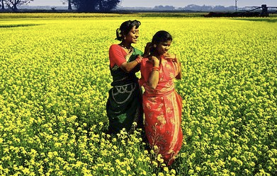

Transformer Based Image Captioning in Bangla
========
This Pytorch framework based repo is modified from CA:TR  https://github.com/saahiluppal/catr


<p align="center">
  
  একজন নারী ও একটি শিশ আছে ।
</p>
 

# Dataset:
Download the BanglaLekhaImageCaptions dataset here:
```
https://data.mendeley.com/datasets/rxxch9vw59/2
```


# Usage:

Clone this repo:
```
$ git clone https://github.com/saidulK/catr_for_bangla
```
Install all necessary dependencies:
```
$ pip install -r requirements.txt
```
In order to train with Google Colab, use these files from google drive:
```
https://drive.google.com/drive/folders/1v051sMkJUbk-4awYWMm2NRIa_fYpVWKK?usp=sharing
```
## Preprocessing:
Preprocess and split the dataset with this file:
```
https://colab.research.google.com/drive/16tIyZhIuVtcO2i8S91SnSMionUKtGe2d?usp=sharing
```
## Training:

Set necessary parameters in the ```configurations.py``` file:
```
# Epochs
self.epochs  =  30
self.lr_drop  =  20
self.start_epoch  =  0
self.weight_decay  =  1e-4
# Basic
self.device  =  'cuda'
self.checkpoint  =  './checkpoint.pth'

# Dataset
self.dir  =  '/content/drive/MyDrive/Colab Notebooks/BanglaImageCaption/Data'
self.limit  =  -1
```

Run the file to start training:
```
https://colab.research.google.com/drive/1FntZFNf_O1fxlNMb6m-KQiUjxH8YQrHb?usp=sharing
```

## Generate Captions:
Run the the following file to generate captions for any image:
```
https://drive.google.com/file/d/1aRnCdzlkIXdruuvTr3gj0Ju0OmB5j3_7/view?usp=sharing
```

# License
CATR is released under the Apache 2.0 license. Please see the [LICENSE](LICENSE) file for more information.
